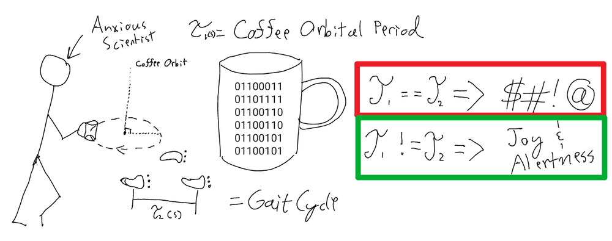

TL;DR: Individual attention is critical for learning. Everyone should have it.

There, now you can skip the rest.

## An idiots tale, told in five parts.

The rest of this is laid out to help understand my motivation and why it is personal. I'll meander from my motivations into a personal story and tie it all together in a neat bow at the end.

### What motivates me

#### My family

My family is my everything and I would burn the world down for them if I needed to. Thankfully, I can avoid prison because they need something different right now. They need a good dad. I try. They generally forgive me.

Being able to look into the future doesn't make you a good dad, but being able to prepare your children for that future (so they have the best chance of success) makes you a slightly better dad than otherwise.

#### Their future

My kids are not being brought into a life of comfort. They're being faced with a future where food shortages are quite likely, where climate refugees are stressing already crumbling social infrastructure and where extreme weather events bring crippling infrastructure damages.

That's already happening.

Within the next fifty years the best case scenarios don't look great. Civilizations in areas where it's already difficult to sustain life are likely to crumble entirely as their environment becomes hostile to life, meaning that there will be at least some small countries which functionally cease to exist.

The humanitarian burden from those climate refugees will cause a rippling cascade of system failure as neighboring countries also fail if they choose to assume the burden.

These are problems that we need to solve, quickly. Many people are working on them now, trying to solve them diligently. They're going to need some help.

Now, we're going to take a short dog leg where I explain why this is personal but, don't worry, I bring it back home in the end.

### I've been young and dumb

I have a very strong memory of earning a plastic travel mug when I was in first grade. There aren't many memories of the school there (touching a lamb's brain, the layout of the school, watching a pottery demonstration) but I have a few solid memories. This is one of them.

I wasn't doing well. I'm not entirely sure why not, or even in which subject (math?), but I remember that a new teacher came in and sat with me, personally, for a good amount of time. She 'incentived' (bribed) me with that mug, provided that I work hard.

I earned the mug and I'm assuming that my grades improved because she did not come back.

I continued to struggle into high school (somewhere around the time that I chose to stop medicating myself for ADD). My grades generally were not good. I remember a fourth grade report card; F, F, D, and F. I think that teacher got fired, though. I vividly remember failing Food Skills and Algebra 2 in high school.

I graduated high school with a 2.1 GPA. Only two others graduated in my class with lower grades than me.

After I graduated high school I spent two years not really doing anything. I drifted from job to job, I wound up withdrawing from online schooling that I wasn't doing, and in the end I decided to join the Army on a whim.

The next eight years were spent in the Army learning a lot about who I was, who I wanted to be, and about how other people work. I also learned many ways not to do things.

I was convinced that I wasn't necessarily very bright but starting to get an inkling that maybe I wasn't a complete idiot; I wanted to try something new. I also, quite possibly, wanted to compete with my sister, the doctor. So, I thought to myself 'what is the hardest thing you could do?', and that's why I went back to school for aerospace engineering.

Four years of being a full time student while trying to be a husband and father marked one of the hardest times in my life. I struggled and, in the end, graduated.

### Was I really dumb?

The short answer is: 'probably not'.

I got a 30 on my ACT when I took it in High School. I did not study. I read Jurassic Park when I was in fourth grade simply because I thought the cover was neat. I spent most of my class time illicitly reading. I got a 99 on my ASVAB when I joined the Army, for what that's worth (not much.) I've learned, and mostly forgotten, more than one language. My grades in technical school in the military were remarkably good. There are other indicators like the fact that the same semester I failed food skills I did ok in physics (I said ok, not great!), chem 2, and business law.

My undergraduate was very challenging for personal reasons but learning the material generally wasn't difficult. My grades did start to slip when I was maintaining a job on top of a full load of upper level engineering courses, while my wife was in school, too.

That wasn't fun, though we overcame that struggle in the end.

I think I treasure three things that I learned in my undergraduate work above all:

* I can learn new things pretty easily, and I love learning.
* A friend taught me how to carry a coffee cup while walking without spilling (seriously blew my mind).
* I don't give a flying F. about airplanes. Not one. I do like math, though.

Now I've got an M.S. in computer science on top of a B.S. in aerospace engineering (plus a nifty associates degree I nabbed from my language school) and I work as a Data Scientist. I spend every day thinking for a living and I'm at least ok at my job.

If I'd had someone who could work with me personally more often would things have worked out differently? Would I have fallen in love with learning sooner if I had someone who could answer any question I asked?

### What would be different if I'd had individual attention?

What if I'd been invested because I was interested? What if someone spent time with me, engaging me?

Would it have made a difference?

It doesn't really matter for me, because it's in the past.

But, let me tell you a story.

Little Bobby sits down at the kitchen table to do his homework.

He doesn't care about much beyond playing, but he's going to go on someday to win a Nobel for developing a drought resistant variant of grain.

Now, let me tell you a couple billion stories about a few billion little Bobbys. Imagine them as a literal constellation of two billion stars. (Approximately two billion people on earth are under age 14.)

Economic impoverishment is almost insurmountable for children. There goes about ten percent, so I want you to imagine ten percent of those lights winking out. A lot of other people still have opportunity, but those one in ten stars (200 million) just went dark. More of them just don't have access to education period so knock that down, again, by around 3% of the original number (60 million). Take some untold number of them who learning just doesn't click for and more stars dim. There are a lot of interesting statistics relevant to education in the world and it looks like they boil down to:

* Access to high quality education is not guaranteed.
* Access to individualized attention in education is not guaranteed and is expensive.

Watch some more of those lights flicker and fade.

* A good chunk of people do not continue on to secondary education.
* Individual attention is not feasible for a human to provide at all times.

More lights.

In the end, there are too many lights dark.

There are some other interesting statistics:

* Education is correlated with satisfaction, income and success.
* Education is correlated with a code of morality that views the self as not always being the most important thing.

How can we provide everyone with the same standard for learning? How can we keep *all* the lights on? How can we give *everyone* individual attention?

### Everyone deserves individual attention

Answers to questions are generally just a Google query away. We're raising the future to be comfortable with the idea of having information readily available and dropping them into a sea of knowledge. We should at least help them by gaming the system in their favor and providing every child with a personalized recommendation system that can reliably provide each child the most appropriate learning materials for them to achieve their educational goal.

#### But everyone learns differently.

Human learning theory revolves around this. Some learning theories are appropriate for certain students, but not for others. For some children having individualized attention is required for them to succeed.

My children and their future are dearly important to me and I'm getting older every day. I've lived a life full of stupid at nearly every turn and I've somehow managed to come out on top, though far later than I believe I should have.

I was medicated for ADD until I decided (at about age 15) that I was done taking the medication. It's around that time that my grades (already poor) took a nose dive. I failed Algebra 2 in sophomore year of high school.

I ask myself, fairly often, what if I'd had someone that could teach me and understand me? Would I have failed? Where would I be?

Everyone deserves to be provided the potential for greatness. Everyone deserves individual, readily accessible, education. Everyone deserves a chance to make a difference. Everyone deserves a fair shot in life.

So that's where we are, now.

### Let's fix all the problems.

I'm working to solve the problems of the future, today. I probably sound egotistical, or crazy, but that doesn't really matter and I don't care anymore. I've got nothing really left to prove, beyond another piece of paper. What's the point of a PhD? Research a topic sufficiently to provide new learning in an area and appropriately source your material such that it has credibility. Great, that's what I'm planning on doing. Would it be nice to have a piece of paper acknowledging what I did? Sure. Wouldn't it be better to just do it, though?

I develop statistical learning applications for a living and have the skillset to go from formulating a hypothesis to design of experiments to understanding how those results support / disprove my hypothesis. I can develop containerized applications and I have relevant experience developing scalable computation. I have an understanding of machine learning and computer science.

There's nothing in this pipeline that I can't do alone. I could do it faster with friends.

My research is primarily focused on couching human learning theory in a statistical learning framework and optimizing the rate of learning in humans.

I aim to provide every child with a 'Buddy AI' whose sole purpose is to support that child with information that is most likely to resonate with them and be helpful. Some kids learn by doing, some by reading, some by watching. This algorithm will learn to approximate the child's learning style and will provide material which is predicted to maximize how quickly that child uses the information to build skills.

Let's go light up the stars.